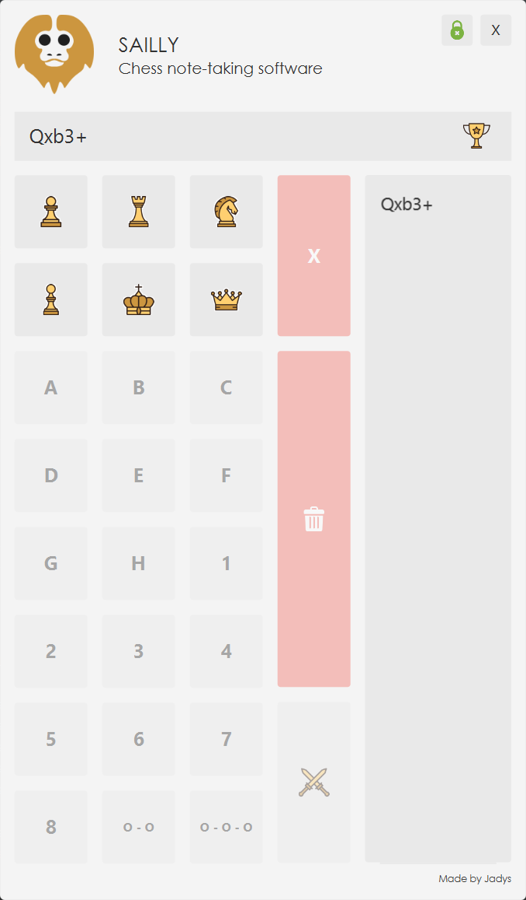

<p align="center"></p>

# SAILLY

  

Sailly est un projet open source permettant la prise de notes selon la notation algébrique simplifiée pour le jeu des échecs. La solution est développée autour de Java et utilise la plateforme d'application client [JavaFX](https://openjfx.io/) ainsi que la bibliothèque [JFoenix](https://github.com/sshahine/JFoenix) pour la partie graphique.

Initialement conçu pour les personnes atteintes de la [maladie  de la sclérose latérale amyotrophique](https://www.inserm.fr/information-en-sante/dossiers-information/sclerose-laterale-amyotrophique-sla-maladie-charcot) également appelé maladie de Charcot, l'application est plus généralement destiné à toute personne présentant une incapacité moteur. L'objectif est de faciliter la communication avec une tiers personne afin qu'elle déplace les pièces pendant une partie d'échecs.

Nous travaillons sur l'éligibilité de l'application pendant les tournois officiels organisés par la [Fédération Française des Échecs](http://www.echecs.asso.fr/).

## Installation

Télécharger la dernière version portable ou bien l'installateur pour Windows [ici](https://github.com/jadys-corp/sailly/releases/).

Pour le moment, nous distribuons seulement un exécutable et un installateur pour la plateforme Windows, pour les autres plateformes il sera nécéssaire de compiler le projet et de le lancer via un terminal. Pour se faire, clonez ce dépôt avec la commande :

```bash
git clone git@github.com:jadys-corp/sailly.git
```

Rendez-vous dans le dossier du projet et lancez la commande pour compiler :

```bash
cd sailly
./gradlew build
```

Enfin, lancez l'application avec la commande suivante :

```bash
./gradlew run
```

## Utilisation

<div>
  
  <p>L'application a été pensée pour être ergonomique et se décompose ainsi en trois parties distinctes. Chacunes de ces parties ou "zones" de l'application répond à un besoin identifié détaillé ci-après.</p>
  <p>La <b>zone d'affichage</b> se situe en haut à gauche de l'interface, cette partie permet la visualisation du coup à jouer.</p>
  <p>La <b>zone de saisie</b> se situe à gauche, celle-ci permet d'intéragir avec les boutons afin de décrire une action.</p>
  <p>La <b>zone d'historique</b> se situe à droite, elle affiche les coups précedemments saisis.</p>
  <p>Il est possible de verrouiller l'application afin qu'elle reste en permanance au dessus des autres fenêtres en utilisant le bouton prévu à cet effet : </p>
  <p> L'application est verrouillée et restera au dessus des autres fenêtres même lors de la perte du focus.</p>
  <p> L'application n'est pas verrouillée et adopte un comportement "classique" en passant en arrière-plan lors de la perte du focus.</p>
</div>

<br><br><br><br><br><br>

---

**Tableaux de correspondance**

| ANGLAIS    | FRANÇAIS     |
| ---------- | ------------ |
| K - King   | R - Roi      |
| Q - Queen  | D - Dame     |
| B - Bishop | F - Fou      |
| N - Knight | C - Cavalier |
| R - Rook   | T - Tour     |
| P - Pawn   | P - Pion     |

**Remarque** : cette application ne permet que la notation algébrique d'un coup, elle n'est pas capable d'aider le joueur dans sa prise de décision.
